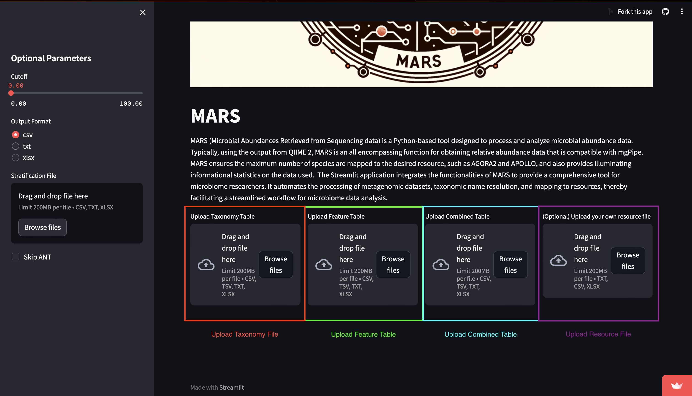
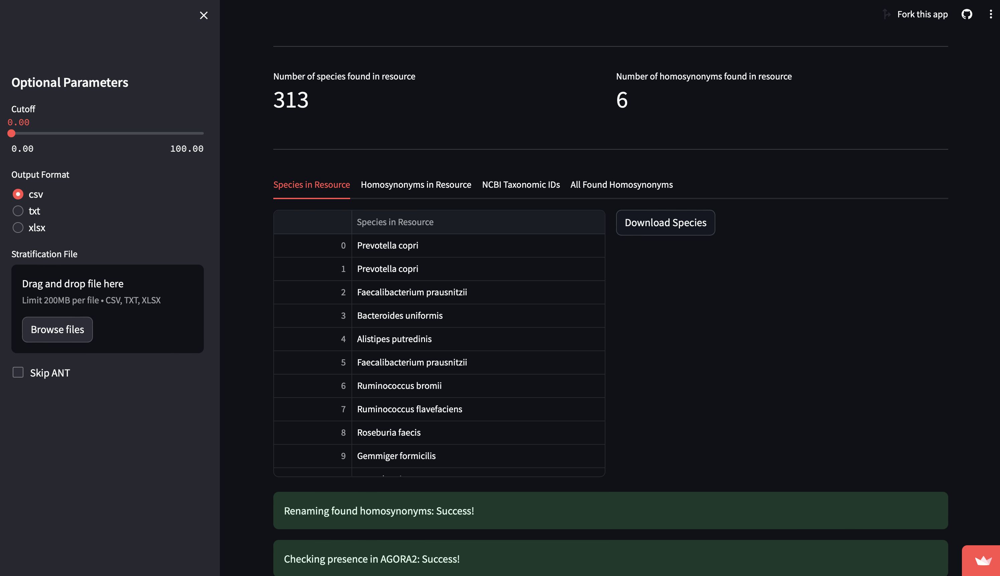
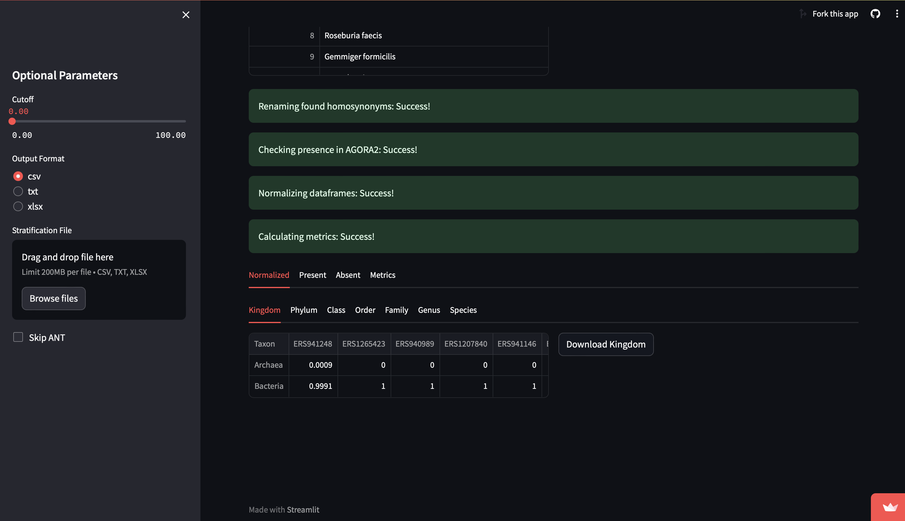

# MARS-tutorial
This tutorial guides you through using the MARS Streamlit application

## Table of Contents
1. [User Interface Walkthrough](#user-interface-walkthrough)
    1. [Optional Parameters](#optional-parameters)
    2. [File Upload Sections](#file-upload-sections)
    3. [Getting Started](#getting-started)
    4. [Results Summary](#results-summary)
    5. [Results Table](#results-table)
    6. [Metric Table](#metric-table)
2. [Data Input](#data-input)
    1. [Accepted Data Formats](#accepted-data-formats)
    2. [Preparing Your Data](#preparing-your-data)
    3. [Upload Your Data](#uploading-your-data)
    4. [Using Example Files](#using-example-files)
3. [Troubleshooting](#troubleshooting)
    1. [Common Issues and Immediate Steps](#common-issuees-and-immediate-steps)
    2. [Contact Support](#contact-support)
    3. [Report an Issue on GitHub](#report-an-issue-on-github)
4. [Appendix](#appendix)
    1. [Frequently Asked Questions (FAQS)](#faqs)
    2. [Glossary of Terms](#glossary-of-terms)
    3. [Additional Resources](#additional-resources)
    4. [Acknowledgments](#acknowlegments)

## User Interface Walkthrough

### Optional Parameters

**Cutoff Slider**: This slider allows you to set a cutoff value for the relative abundance data. Any taxa with values below this threshold can be ignored or considered as noise.

**Output Format**: Here you can select the desired output file format for your processed data. The options include:

**csv**: A comma-separated values file which is widely used and compatible with most spreadsheet applications.
**txt**: A plain text file.
**xlsx**: An Excel spreadsheet file format.
**Stratification File Upload**: You can drag and drop or browse to upload a stratification file. This file should contain groupings or classifications within your data, which can be useful for downstream analysis.

**Skip ANT Checkbox**: If you want to process your data without using the Automated NCBI Taxonomy (ANT) tool, you can check this box.

### File Upload Sections

There are four main areas where you can upload different types of files:

1. **Upload Taxonomy Table**
Drag and drop or browse to upload your taxonomy table here. The file should be in one of the following formats: CSV, TSV, TXT, XLSX.

2. **Upload Feature Table**
Here you can upload the feature table, which typically includes quantitative data on the features (like OTUs, taxa, or genes) identified in your samples.

3. **Upload Combined Table**
If you have a combined table that includes both taxonomy and feature data, you can upload it in this section.

4. **Upload Resource File (Optional)**
This is an optional upload for your own resource file. Use this if you have a custom resource file that you want to include in the analysis.

Each file upload section has a limit of 200MB per file.

After you've uploaded your files, the application will process the data based on MARS and ANT algorithms, and you'll be able to download the results or view them within the interface.

### Getting Started

To begin using the application:

1. Set your desired optional parameters.
2. Upload the necessary files in their respective sections.
3. If you choose to skip ANT, make sure to check the box.
4. Once all files are uploaded, the application will start processing your data when the `Process Files` button is clicked.
5. After processing, view the results directly in the application or download the output files in your chosen format.

**Process Files**: This is the button to start the processing of your data.

The Streamlit application will provide real-time updates on the processing status. 

### Results Summary 

After the processing is complete, the application displays a summary of the results along with options to download the data. Here's an explanation of each element visible in this section:

**Number of species found in resource**: This indicates the total number of unique species identified in the selected resource from your dataset, which in this case is `313`.

**Number of homosynonyms found in resource**: Displays the count of homosynonymous terms identified, `6` in this case, which helps in understanding the complexity of taxonomic naming in your dataset.

### Results Table
The results table is divided into several columns, each providing valuable information:

**Species in Resource**: Lists the species that were successfully mapped to the resource database from your dataset.

**Homosynonyms in Resource**: Shows if any alternative names (homosynonyms) that correspond to the primary species name were found in the resource.

**NCBI Taxonomic IDs**: Provides the unique identifier assigned to each species by the NCBI Taxonomy database.

**All Found Homosynonyms**: Lists all the homosynonyms or alternative names found for each species.

**Download Species**: This button allows you to download the list of species and related information processed by the application.

Once your data has gone through normalization and the presence checks in the resource, the application will display the outputs as follows:

### Metric Table

The metric table provides a detailed breakdown of the normalized data across different taxonomic levels:

**Normalized**: This column shows the normalized values, indicating the relative abundance or presence of taxa within the sample after normalization.

**Present**: The number of times a taxon appears in the dataset (i.e., is present).

**Absent**: A count of how many taxa expected in the resource were not found in the dataset.

**Metrics**: This is a placeholder that suggests additional metrics may be displayed or available for download.

The table headers (Kingdom, Phylum, Class, Order, Family, Genus, Species) represent different taxonomic classifications of the organisms in your dataset. Each row under these headers shows the corresponding data for each taxon, such as 'Archaea' or 'Bacteria', and their respective normalized values and presence across various taxonomic categories.

**Download Kingdom**: This button allows you to download the information related to the 'Kingdom' taxonomic level. Presumably, similar buttons for other taxonomic levels would allow you to download those specific datasets as well.

## Data Input

Proper data formatting is crucial for the successful operation of the MARS-ANT Streamlit application. This section will guide you through the process of preparing and uploading your data.

### Accepted Data Formats
Our application accepts the following file types for data input:

* CSV (Comma-Separated Values)
* TXT (Plain Text)
* XLSX (Excel Spreadsheet)
Each file should follow the structure of our example templates to ensure compatibility with the application.

### Preparing Your Data

**Review Example Files**: Before preparing your data, review the example files provided in the `files` directory of our tutorial GitHub page. These files represent the desired format and structure your data should emulate.

**Format Your Data**: Arrange your data to match the format of the example files. This typically involves ensuring that the columns and headers in your data correspond correctly with those in the example files.

**Save Your File**: Once your data matches the template format, save your file in one of the accepted formats (CSV, TXT, XLSX).

### Uploading Your Data
To upload your data to the application:

1. Click on the 'Browse files' button in the corresponding data upload section of the application.
2. Navigate to the location on your computer where your data file is saved.
3. Select the file and click 'Open' to upload it to the application.
If you encounter any issues with data formatting or the upload process, please refer to the 'Troubleshooting' section of this tutorial.

### Using Example Files
If you're new to the application or would like to run a test analysis, you can use the example files provided. Here's how:

1. Navigate to the `files` directory on the tutorial GitHub page.
2. Download the example files to your local machine.
Follow the 'Uploading Your Data' steps mentioned above, using the example files you downloaded.
3. Remember, the accuracy of the application's output is dependent on the correct formatting of the input data. Please ensure your data accurately reflects the structure of the provided examples for optimal results.

## Troubleshooting

Should you encounter any difficulties while using the MARS-ANT Streamlit application, we offer the following steps to help resolve your issues:

### Common Issues and Immediate Steps

Before reaching out for support, consider the following common issues and immediate steps you can take:

**Data Format Errors**: Ensure your data files strictly adhere to the formats outlined in the 'Data Input' section. Matching the example files' structure is crucial.

**Upload Failures**: If your data fails to upload, check that the file size does not exceed the 200MB limit and that you are using the correct file type (CSV, TXT, XLSX).

**Processing Errors**: Make sure that all required fields in your data are filled and that there are no missing values where the application expects data.

### Contact Support

If after these steps your issue remains unresolved, please contact us for further assistance:

**Email Support**: For direct support, email Timothy.Hulshof@universityofgalway.ie. When emailing, please provide a detailed description of the issue, the steps you've taken to resolve it, and any error messages you've encountered.

### Report an Issue on GitHub
For technical issues that may benefit from public discussion or for enhancement suggestions, create an issue on our GitHub repository:

1. Visit the MARS GitHub repository issue page.
2. Click on the 'New issue' button.
3. Provide a title and a detailed description of the issue or enhancement suggestion.
Submit the issue.
4. Creating an issue on GitHub will notify our developers, and we will investigate the problem as soon as possible. Additionally, other users may contribute to resolving the issue or provide temporary workarounds.

## Appendix

### Frequently Asked Questions (FAQs)

**Q: What should I do if the data processing takes longer than expected?**
A: Data processing time can vary based on server load and data complexity. If processing takes an unusually long time, try the following:

1. Ensure that your internet connection is stable.
2. Refresh the application page and attempt to upload your data again.
3. If the problem persists, please reach out for support or report an issue on our GitHub.

**Q: Can I use data formats other than CSV, TXT, or XLSX?**
A: Currently, the application is designed to work with CSV, TXT, and XLSX formats only. Please convert your data to one of these formats before uploading.

### Glossary of Terms

**Taxonomic ID**: A unique identifier for a species used in databases like NCBI.

**Homosynonyms**: Different names that refer to the same taxonomic entity.

### Additional Resources

**Publication Reference**: To understand the scientific background and algorithms, refer to our publication.

### Acknowledgments

We would like to acknowledge

