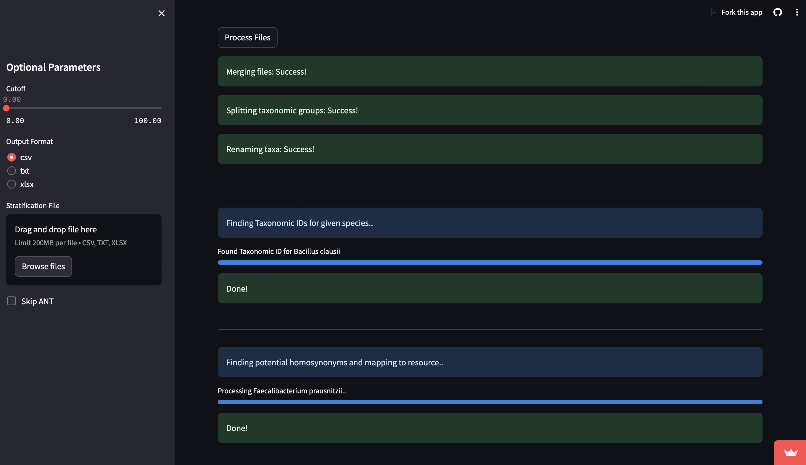

# MARS-tutorial
This tutorial guides you through using the MARS Streamlit application

## Table of Contents
1. [User Interface Walkthrough](#user-interface-walkthrough)
2. [Data Input](#data-input)
3. [Using the Application](#using-the-application)
4. [Interpreting Results](#interpreting-results)
5. [Troubleshooting](#troubleshooting)
6. [Appendix](#appendix)

## User Interface Walkthrough

## Data Input
See files directory for examples of acceptable input files

